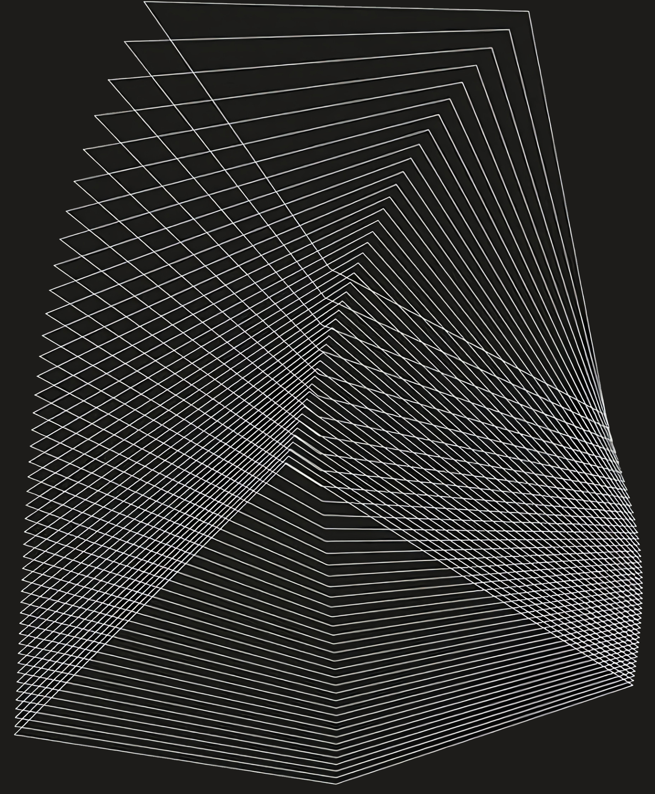

<a name="readme-top"></a>

[![Contributors][contributors-shield]][contributors-url]
[![Issues][issues-shield]][issues-url]
[![Stargazers][stars-shield]][stars-url]
[![MIT License][license-shield]][license-url]

<!-- PROJECT LOGO -->
<br />
<div align="center">
  <a href="https://github.com/ISEN-Promo-Pole-developpement-Discord/Sigma-VI">
    
  </a>

<h3 align="center">Sigma - Virtual Assistant</h3>

  <p align="center">
    A student driven projet of discord virtual assistant
    <br />
    <a href="https://github.com/ISEN-Promo-Pole-developpement-Discord/Sigma-VI/wiki"><strong>Explore the docs »</strong></a>
    <br />
    <br />
    <a href="https://github.com/ISEN-Promo-Pole-developpement-Discord/Sigma-VI/issues">Report Bug</a>
    ·
    <a href="https://github.com/ISEN-Promo-Pole-developpement-Discord/Sigma-VI/issues">Request Feature</a>
  </p>
</div>


<!-- TABLE OF CONTENTS -->
<details>
  <summary>Table of Contents</summary>
  <ol>
    <li>
      <a href="#about-the-project">About The Project</a>
      <ul>
        <li><a href="#built-with">Built With</a></li>
      </ul>
    </li>
    <li>
      <a href="#getting-started">Getting Started</a>
      <ul>
        <li><a href="#prerequisites">Prerequisites</a></li>
        <li><a href="#installation">Installation</a></li>
      </ul>
    </li>
    <li><a href="#usage">Usage</a></li>
    <li><a href="#roadmap">Roadmap</a></li>
    <li><a href="#contributing">Contributing</a></li>
    <li><a href="#license">License</a></li>
    <li><a href="#contact">Contact</a></li>
    <li><a href="#acknowledgments">Acknowledgments</a></li>
  </ol>
</details>


<!-- ABOUT THE PROJECT -->
## About The Project

[![Sigma Discord Screen Shot][product-screenshot]](https://sigma-bot.fr)

As students of the mediterranean higher institute of electronics and digital [(ISEN)](https://www.isen-mediterranee.fr/), we wanted a plateform to allow us to practice while offering our peers services, data and modules to facilitate their studies.
This is where Sigma comes in.

What is Sigma :
* A management, moderation and data link platform between the different guilds linked to ISEN
* A modular virtual assistant allowing students to access many services related or not to their studies
* A collaborative open source student project


Its modular chassis allows interaction modules to be created or modified easily and with a high level of abstraction.

<p align="right">(<a href="#readme-top">back to top</a>)</p>

### Built With

* [![JavaScript][js]][js-url]
* [![Node.js][node.js]][nodejs-url]
* [![NPM][npm]][npm-url]
* [![Discord.js][discord.js]][discordJS-url]


<p align="right">(<a href="#readme-top">back to top</a>)</p>


<!-- GETTING STARTED -->
## Getting Started

This will be how to get a local copy up and running, in order to test the bot or to contribute to the project.

### Prerequisites

You should have installed [![Node.js][node.js_small]][nodejs-url] and [![npm][npm_small]][npm-url] on your computer.
* Go to [nodejs.org/en/download/](https://nodejs.org/en/download/) and download the latest version of node.js and npm.
* Install it on your computer.
* Check if it is installed by typing in your terminal :
  ```sh
  node -v
  npm -v
  ```

### Installation

1. Clone the repo
   ```sh
   git clone https://github.com/ISEN-Promo-Pole-developpement-Discord/Sigma-VI.git
   ```
2. go to the folder
   ```sh
   cd Sigma-VI/bot
   ```
3. Install NPM packages
   ```sh
    npm install
   ```
4. Start the bot and wait for it to generate the config file
   ```sh
   npm start
   ```
5. Fill the config file with your bot token and database credentials
   ```sh
   nano config.json
   ```
6. Start the bot again
   ```sh
    npm start
    ```

<p align="right">(<a href="#readme-top">back to top</a>)</p>


<!-- USAGE EXAMPLES -->
## Usage

Use this space to show useful examples of how a project can be used. Additional screenshots, code examples and demos work well in this space. You may also link to more resources.

_For more examples, please refer to the [Documentation](https://github.com/ISEN-Promo-Pole-developpement-Discord/Sigma-VI/wiki)_

<p align="right">(<a href="#readme-top">back to top</a>)</p>


<!-- ROADMAP -->
## Roadmap
- [ ] Modules
    - [x] Planning module
    - [x] Association module
    - [ ] Help module
    - [ ] Ping module
    - [ ] Mobility Module
    - [ ] Contacts Module
- [x] Forms
    - [x] Main server welcome form
    - [x] Sub servers welcome form
- [ ] Database
    - [x] Users database
    - [x] Guilds database
    - [x] Associations database
    - [ ] Contacts database
    - [ ] Mobility database

See the [open issues](https://github.com/ISEN-Promo-Pole-developpement-Discord/Sigma-VI/issues) for a full list of proposed features (and known issues).

<p align="right">(<a href="#readme-top">back to top</a>)</p>


<!-- CONTRIBUTING -->
## Contributing

Contributions are what make the open source community such an amazing place to learn, inspire, and create. Any contributions you make are **greatly appreciated**.

If you have a suggestion that would make this better, please fork the repo and create a pull request. You can also simply open an issue with the tag "enhancement".
Don't forget to give the project a star!

1. Fork the Project
2. Create your Feature Branch (`git checkout -b feature/AmazingFeature`)
3. Commit your Changes (`git commit -m 'Add some AmazingFeature'`)
4. Push to the Branch (`git push origin feature/AmazingFeature`)
5. Open a Pull Request

<p align="right">(<a href="#readme-top">back to top</a>)</p>


<!-- LICENSE -->
## License

Distributed under the MIT License. See `LICENSE.txt` for more information.

<p align="right">(<a href="#readme-top">back to top</a>)</p>


<!-- CONTACT -->
## Contact

* Tom Bourjala - tom.bourjala@isen.yncrea.fr - [![LinkedIn][linkedin-shield]](https://www.linkedin.com/in/tom-bourjala/)
* Thomas Seignour - thomas.seignour@isen.yncrea.fr - [![LinkedIn][linkedin-shield]](https://www.linkedin.com/in/thomas-seignour/)

Project Link: [https://github.com/ISEN-Promo-Pole-developpement-Discord/Sigma-VI](https://github.com/ISEN-Promo-Pole-developpement-Discord/Sigma-VI)

<p align="right">(<a href="#readme-top">back to top</a>)</p>


<!-- ACKNOWLEDGMENTS -->
## Acknowledgments

* [Discord.js documentation](https://discord.js.org/#/docs/discord.js/main/general/welcome)
* [Regex 101 Tool](https://regex101.com/)

<p align="right">(<a href="#readme-top">back to top</a>)</p>


<!-- MARKDOWN LINKS & IMAGES -->
<!-- https://www.markdownguide.org/basic-syntax/#reference-style-links -->
[contributors-shield]: https://img.shields.io/github/contributors/ISEN-Promo-Pole-developpement-Discord/Sigma-VI.svg?style=for-the-badge
[contributors-url]: https://github.com/ISEN-Promo-Pole-developpement-Discord/Sigma-VI/graphs/contributors
[stars-shield]: https://img.shields.io/github/stars/ISEN-Promo-Pole-developpement-Discord/Sigma-VI.svg?style=for-the-badge
[stars-url]: https://github.com/ISEN-Promo-Pole-developpement-Discord/Sigma-VI/stargazers
[issues-shield]: https://img.shields.io/github/issues/ISEN-Promo-Pole-developpement-Discord/Sigma-VI.svg?style=for-the-badge
[issues-url]: https://github.com/ISEN-Promo-Pole-developpement-Discord/Sigma-VI/issues
[license-shield]: https://img.shields.io/github/license/ISEN-Promo-Pole-developpement-Discord/Sigma-VI.svg?style=for-the-badge
[license-url]: https://github.com/ISEN-Promo-Pole-developpement-Discord/Sigma-VI/blob/master/LICENSE.txt
[linkedin-shield]: https://img.shields.io/badge/LinkedIn-0A66C2?style=flat-square&logo=linkedin&logoColor=white
[product-screenshot]: images/discord.png
[discord.js]: https://img.shields.io/badge/Discord.js-5865F2?style=for-the-badge&logo=discord&logoColor=white
[discordJS-url]: https://discord.js.org/
[js]: https://img.shields.io/badge/JavaScript-F7DF1E?style=for-the-badge&logo=javascript&logoColor=black
[js-url]: https://www.javascript.com/
[node.js]: https://img.shields.io/badge/Node.js-339933?style=for-the-badge&logo=node.js&logoColor=white
[node.js_small]: https://img.shields.io/badge/Node.js-339933?style=flat-square&logo=node.js&logoColor=white
[nodejs-url]: https://nodejs.org/
[npm]: https://img.shields.io/badge/npm-CB3837?style=for-the-badge&logo=npm&logoColor=white
[npm_small]: https://img.shields.io/badge/npm-CB3837?style=flat-square&logo=npm&logoColor=white
[npm-url]: https://www.npmjs.com/